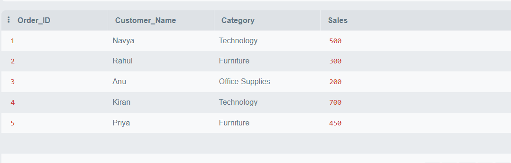
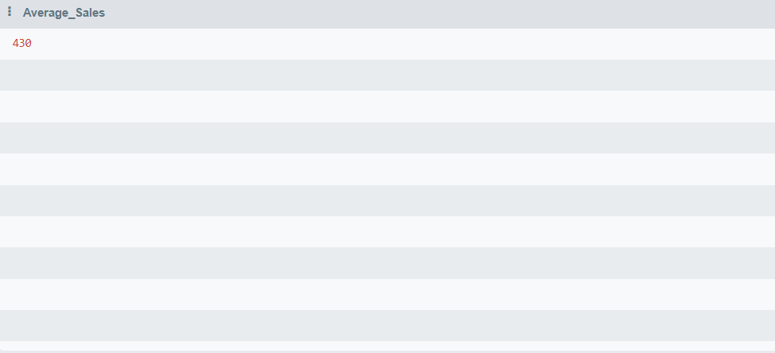
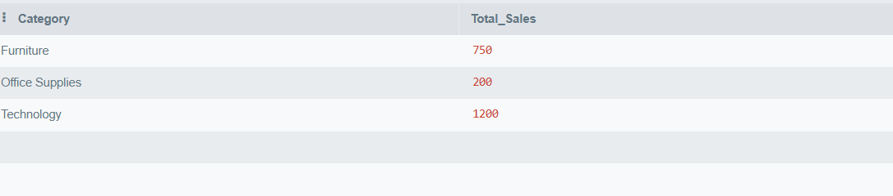
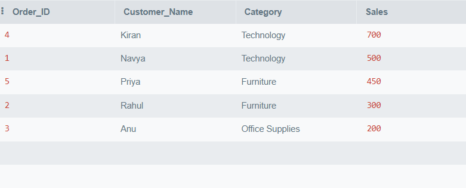

# 🛒 SQL E-commerce Analysis

## 📌 Project Overview
This project contains beginner SQL queries used to analyze e-commerce sales, customers, and product performance using SQLite.

The project demonstrates basic SQL operations such as:
- Creating tables
- Inserting data
- Retrieving records
- Performing sales analysis

---

## 🛠️ Tools & Technologies Used
- SQL
- SQLite Online
- Git & GitHub

---

## 📂 Project Structure

```text
sql-ecommerce-analysis/
│
├── datasets/
│
├── sql_queries/
│   └── basic_queries.sql
│
├── screenshots/
│   └── sql_output.png
│
├── README.md
└── insights.md
```

---

## 📜 SQL Queries Used

### Create Orders Table

```sql
CREATE TABLE orders (
    Order_ID INT,
    Customer_Name TEXT,
    Category TEXT,
    Sales FLOAT
);
```

---

### Insert Data into Table

```sql
INSERT INTO orders VALUES
(1, 'Navya', 'Technology', 500),
(2, 'Rahul', 'Furniture', 300),
(3, 'Anu', 'Office Supplies', 200),
(4, 'Kiran', 'Technology', 700),
(5, 'Priya', 'Furniture', 450);
```

---

### Retrieve All Records

```sql
SELECT * FROM orders;
```

---

## 📸 SQL Output Screenshot

 


## 📈 Advanced SQL Query Outputs

### Total Sales


---

### Average Sales



---

### Highest Sale


---

### Category Wise Sales



---

### Order By Sales



---

## 📊 Analysis Performed
- Created SQL table
- Inserted sample e-commerce sales data
- Retrieved customer order records
- Analyzed category-wise sales data

---

## 🎯 Skills Demonstrated
- SQL Syntax
- Table Creation
- Data Insertion
- SELECT Queries
- Database Basics
- GitHub Project Structuring

--- 

## 📚 Future Improvements

- Add more advanced SQL queries
- Connect real datasets
- Perform joins between tables
- Build SQL dashboards
- Integrate with Power BI
- 
---

## 🚀 Outcome of Project
This project demonstrates beginner-level SQL skills and understanding of database operations using a simple e-commerce sales dataset.
